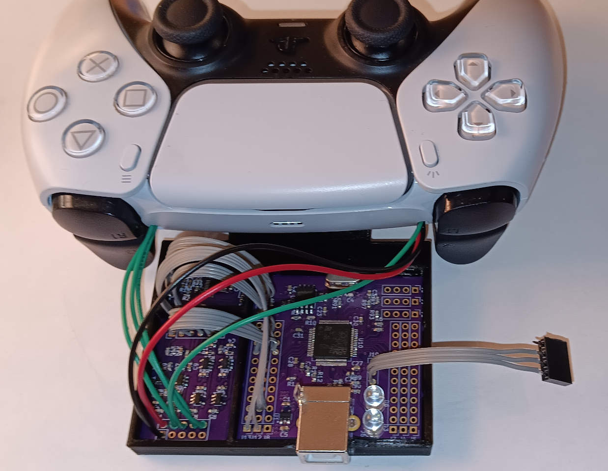
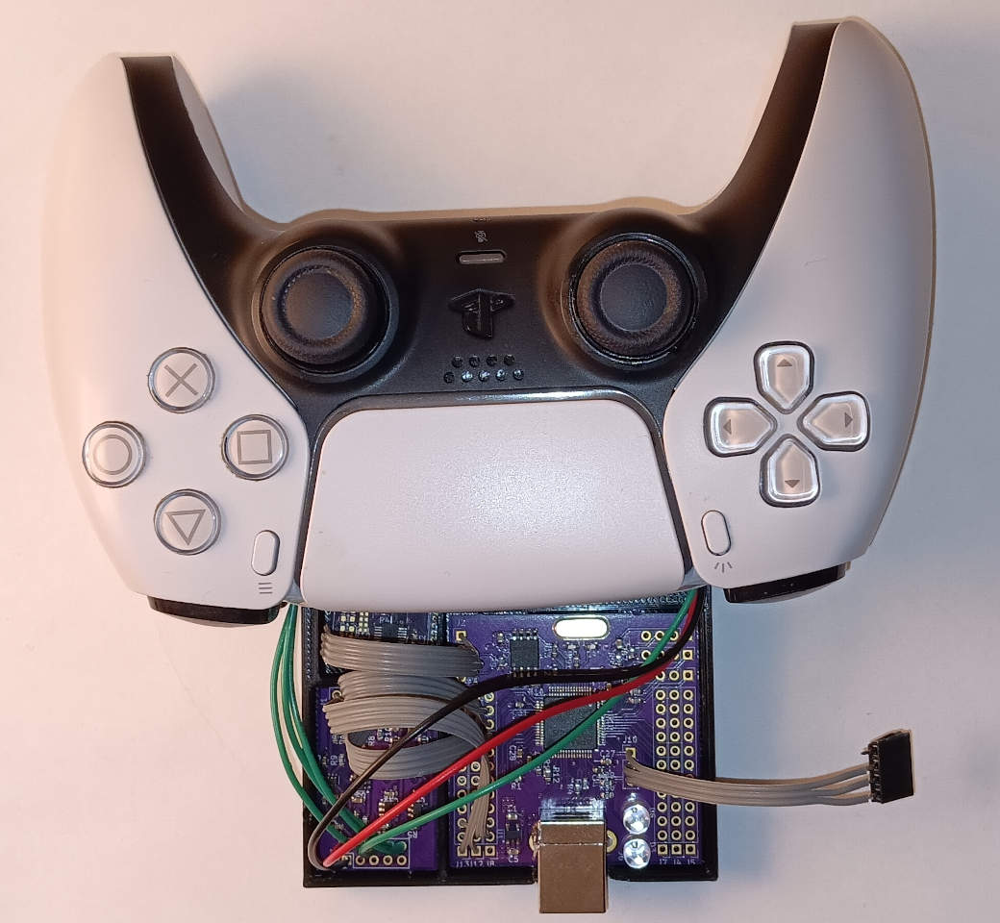

# A hardware project - Inertial Aiming Override for DualSense Playstation 5 controller.

| Image 1 | Image 2 |
|---------|---------|
|  |  |

Constant overshooting. Frustrating undershooting. The endless struggle to place the crosshair exactly on target.  Thumbsticks that refuse to obey your intent.  Another great game launches - only for you to discover it does not support inertial aiming. 

Looks familiar?  

Scenes like these are happening all over the galazy right now!

But there is a way forward. 
Forget the fight against clumsy thumbsticks. 
Embrace inertial aiming override.  

Play on par with keyboard and mouse players.  
Achieve precision where there was chaos.  
Experience smooth control where there was frustration.  
Unlock faster reaction times with natural motion input.  

Spread managed accuracy across every battlefield.  
Use the inertial aiming override device.  
Leave the thumbstick struggle behind.

This repository contains a prototype hardware/firmware project that **overrides the internal thumbstick signals of a PlayStation DualSense controller** using an external inertial sensor (BMI085 IMU).  
The goal: enable **inertial aiming** in games that do not natively support it, by forcing thumbstick input derived from gyroscope/accelerometer data.
There are a few products on the market which filter USB trafic of the controller and inject keyboard and mouse. However, it only can work as soon as it is over USB and not over Bluetooth.
The hardware override ensures that it works no matter what.

---

## Target Games

This override is intended to make aiming more convenient in titles lacking native inertial support:

| Picture | Game | Notes |
|------|-------|------|
|  | Arc Raiders | No native inertial aiming |
|  |Space Marine 2 | No native inertial aiming |
|  |Horizon Zero Dawn (PS4) | PS5 version supports inertial aiming but the main character has been made less cute |
|  |Call of Duty: Black Ops Cold War | No native inertial aiming |
|  |Stellar Blade | No native inertial aiming, needed when shooting targets |

*(More titles may be added as I find out the intertial aiming status)*

---

## 📂 Project Structure

- **`firmware/`**  
  Board configuration for MicroPython firmware supporting the BMI085 IMU.  
  Runs on a custom STM32F405 board with USB‑B and 16 MB SPI flash.

- **`mechanical/`**  
  Blender3D project for the mechanical tray.  
  Designed to attach under the DualSense controller with double‑sided tape.

- **`python/`**  
  Contains `main.py` - the control logic.  
  Current firmware is binary (on/off), but Python makes it easy to experiment with sensitivity curves (e.g., scaling with L2 button depth).

- **`schematics/`**  
  Three PCB designs:
  - `board_bmi085` → breakout for BMI085 IMU  
  - `mp_board` → custom MicroPython‑capable STM32F405RGT6 board with USB‑B and 16MB flash  
  - `override_board` → power management + signal injection  
    - Uses TPS22948 with reverse current blocking  
    - Energizes only when the DualSense thumbsticks are active  
    - Senses L2 button position and drives voltages into the right thumbstick X/Y axes

---

## Deadzone Observations

During testing, the DualSense thumbstick showed **nonsymmetrical deadzones**:

- Neutral voltage - **0.9V**
- Both X and Y axes have insensitive intervals around neutral
- Positive and negative directions differ in width
- Deadzone ranges vary slightly between axes
- Likely **controller-specific**. Different units may have different calibration tables. I only have one to play with.

This means injected signals must account for asymmetric thresholds to achieve smooth inertial aiming.

---

## Disclaimer

This is a **prototype project – not a finished product**.  
- Built for personal experimentation and proof‑of‑concept.  
- If you want to reproduce or extend it, more copies can be made.  
- For compactness and convenience, a **single‑board override design** is recommended (instead of the current 3‑board stack).  

Use at your own risk. This project is not affiliated with Sony or PlayStation.

---

## Future Directions

- Consolidate into a single PCB for easier replication  
- Add configurable sensitivity curves (e.g., proportional to L2 depth)  
- Explore per-controller calibration routines to compensate for asymmetric deadzones  
- Community contributions welcome: firmware tweaks, mechanical refinements, or new game compatibility reports

---

## License

Choose a license that fits your goals (MIT for permissive use, GPL for copyleft).  
Make sure to include it in the repository root.

---

## Project Status

Prototype stage. Contributions, forks, and experiments are encouraged!
